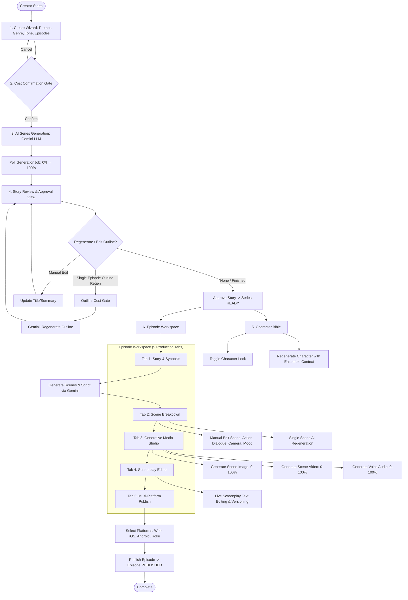
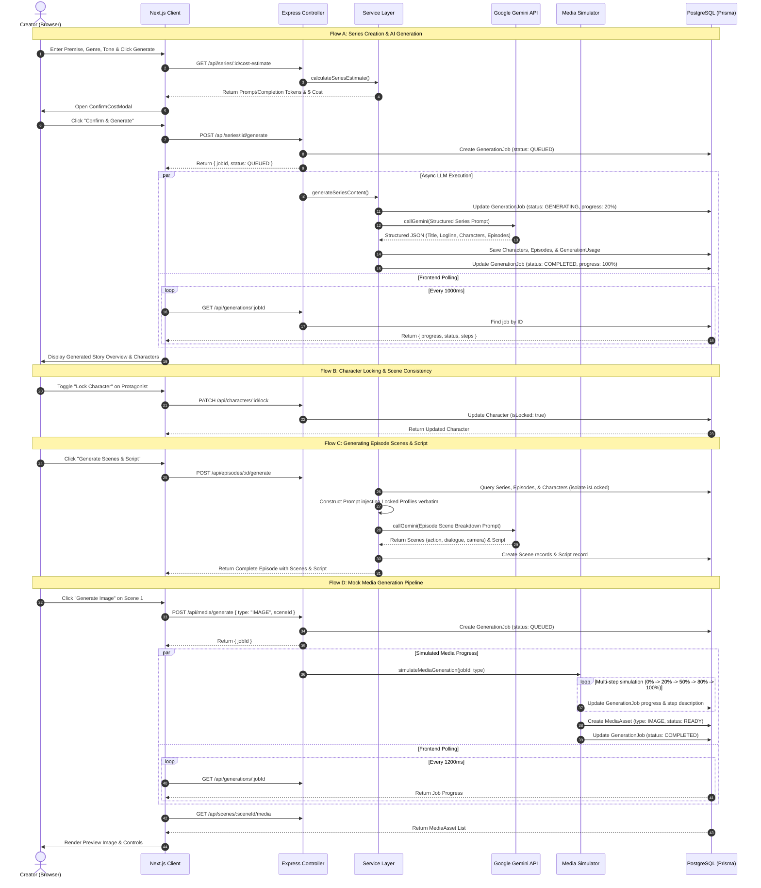

# 📋 Micro Drama Studio — System & Operational Workflow

> **Comprehensive documentation of the end-to-end creator workflow, system data flows, AI orchestration pipelines, and entity lifecycle states.**

---

## 1. Workflow Philosophy: Creator-in-the-Loop

Micro-drama creation (vertical, 2–3 minute high-retention episodic content) demands speed, but fully automated AI pipelines suffer from:
1. **Character Drift:** Characters changing appearances, roles, or speaking styles between episodes.
2. **Destructive Regeneration:** Making a small fix wiping out the entire series or episode.
3. **Runaway Costs:** High token bills without upfront visibility.
4. **Lack of Human Direction:** Inability to override AI dialogue, camera directions, or outlines.

**Micro Drama Studio** enforces a **Creator-in-the-Loop** architecture:
- Every generative action is preceded by a **Cost Confirmation Gate**.
- Core entities (characters, episode outlines, scenes) can be **regenerated independently**.
- Character personas can be **locked** to prevent drift during subsequent episode generation.
- Full **manual editing** is supported at every tier (series, characters, outlines, scenes, scripts).

---

## 2. End-to-End Creator Journey



---

## 3. Communication & Data Flow Architecture

The sequence diagram below illustrates how client interactions propagate through the Express REST API, trigger background processing, interface with Google Gemini and the Media Simulator, and persist state in PostgreSQL:



---

## 4. Detailed Step-by-Step Workflow Phases

### Phase 1: Series Conception & Creation Wizard
- **Inputs Captured:**
  - `prompt`: Core premise / logline (e.g., *"A disgraced surgeon discovers an underground clinic for time-travelers"*).
  - `genre`: Romance, Mystery, Thriller, Sci-Fi, Horror, Drama, Comedy.
  - `tone`: `DARK`, `LIGHT`, `COMEDIC`, `DRAMATIC`, `SUSPENSEFUL`.
  - `episodeCount`: Default 5 (range 3–10).
  - `episodeDuration`: Default 3 minutes.
- **Validation:** Prompt length requirement, valid tone enum, episode bounds.
- **Persistence:** Creates an initial `Series` record in PostgreSQL with status `DRAFT`.

### Phase 2: Pre-Flight Cost Estimation Gate
- **Purpose:** Provide transparent token accounting before invoking the LLM.
- **Estimation Heuristic:**
  - `promptTokens`: Heuristic based on prompt character length + template overhead.
  - `completionTokens`: Projected output calculated as `(episodeCount * 250) + (characterCount * 120) + 300`.
  - `estimatedCost`: Calculated using current Gemini API rates per 1,000 tokens.
- **User Gate:** Generates a blocking `ConfirmCostModal`. If confirmed, the API execution proceeds. If dismissed, no API credits are consumed.

### Phase 3: AI Series & Episodic Outline Generation
- **Prompt Engineering (`backend/src/prompts/index.ts`):**
  - Injects system persona: *"Professional micro-drama showrunner specializing in viral cliffhangers and fast pacing"*.
  - Enforces JSON output adhering to an exact schema:
    ```json
    {
      "title": "Series Title",
      "description": "Logline summary",
      "storyline": "Detailed multi-paragraph arc",
      "characters": [
        {
          "name": "Full Name",
          "role": "Protagonist / Antagonist / Confidant",
          "personality": "Psychological traits",
          "appearance": "Visual cues for casting and image diffusion",
          "background": "Formative history"
        }
      ],
      "episodes": [
        {
          "number": 1,
          "title": "Episode Hook Title",
          "summary": "High-tension 2-3 minute plot beat ending on a cliffhanger"
        }
      ]
    }
    ```
- **Execution & Storage:**
  - Calls `callGemini()` with model fallback cascade (`gemini-3.8-flash` → `gemini-3.5-flash-lite`).
  - Stores entities in PostgreSQL in a single transactional batch.
  - Records usage in `GenerationUsage` table.
  - Transitions `Series.status` to `IN_REVIEW`.

### Phase 4: Story Review, Approval, & Partial Outline Regeneration
- **Review Canvas:** The creator evaluates the generated title, storyline, character cards, and episode beat sheets.
- **Granular Editing Capabilities:**
  - **Edit Story:** Modal to adjust title, genre, tone, or storyline.
  - **Edit Episode Outline:** Modal to manually tweak an individual episode's title and summary.
  - **Regenerate Single Episode Outline (`POST /api/episodes/:id/regenerate-outline`):**
    - Rewrites ONLY that episode's beat sheet using the surrounding series arc.
    - Leaves all other episodes, characters, and scenes intact.
- **Approval Gate:** Once satisfied, the creator clicks **Approve Story**, setting `Series.status = READY`.

### Phase 5: Character Bible & "Character Locking" Consistency Engine
- **The Problem:** When generating episodes 2 through 10, LLMs frequently drift—altering character motivations, names, or key relationships.
- **The Solution:**
  1. **Lock Toggle:** In `/series/[id]/characters`, the creator clicks the lock icon on verified characters (`PATCH /api/characters/:id/lock`), toggling `isLocked: true`.
  2. **Server-Side Guardrail:** If an API call attempts to regenerate a locked character, the backend rejects it with `403 Forbidden: Character is locked`.
  3. **Prompt Injection:** When generating episode scenes or scripts, `episode.service.ts` splits characters into `lockedCharacters` and `unlockedCharacters`. Locked profiles are formatted into a prominent prompt header:
     > `"CRITICAL: The following characters are LOCKED. Their names, roles, personalities, and appearances MUST BE PRESERVED EXACTLY WITHOUT MODIFICATION: ..."`
- **Partial Character Regeneration:** Unlocked characters can be regenerated individually (`POST /api/characters/:id/regenerate`), taking the existing ensemble into account.

### Phase 6: Episode Workspace & Scene Breakdown
- **Workspace Access:** Creator opens `/series/[id]/episodes/[episodeId]`.
- **Scene Breakdown Generation (`POST /api/episodes/:id/generate`):**
  - Generates 3–6 scenes per 2-minute episode.
  - Each scene contains:
    - `number`: Sequence order (1, 2, 3...).
    - `location`: e.g. `INT. ROOFTOP - NIGHT`.
    - `characters`: Array of participating character names.
    - `action`: Concise physical scene directions.
    - `dialogue`: Screenplay dialogue formatted with character cues.
    - `camera`: Camera angle / movement (e.g. `Extreme Close-up on eyes, handheld shake`).
    - `mood`: Emotional tone (e.g. `Tense, Claustrophobic`).
- **Single Scene Regeneration (`POST /api/scenes/:id/regenerate`):**
  - Allows rewriting a single scene's dialogue or action while locking in all surrounding scenes.
- **Manual Scene Editor (`EditSceneModal`):**
  - Direct field-level overrides for all scene properties.

### Phase 7: Generative Media Studio (Mock Pipeline)
- **Design Requirement:** Mock image, video, and voice generation with realistic progress simulation and persistent metadata.
- **Pipeline Progression Steps:**
  - **IMAGE:**
    1. `10%`: Analyzing scene description…
    2. `30%`: Composing visual layout…
    3. `55%`: Rendering image with AI diffusion…
    4. `80%`: Applying color grading…
    5. `100%`: Image generation complete.
  - **VIDEO:**
    1. `10%`: Extracting scene motion cues…
    2. `25%`: Generating keyframes…
    3. `50%`: Interpolating video frames…
    4. `75%`: Adding transitions and effects…
    5. `90%`: Encoding video output…
    6. `100%`: Video generation complete.
  - **AUDIO (Voice-Over):**
    1. `15%`: Analyzing dialogue and tone…
    2. `40%`: Synthesizing voice with AI TTS…
    3. `70%`: Mixing ambient audio layers…
    4. `90%`: Normalizing audio levels…
    5. `100%`: Audio generation complete.
- **Lifecycle & Polling:**
  1. Frontend dispatches `POST /api/media/generate { seriesId, episodeId, sceneId, type }`.
  2. Backend inserts a `GenerationJob` record and starts an asynchronous non-blocking timer loop.
  3. Frontend polls `GET /api/generations/:id` every 1200ms to render real-time progress bars.
  4. On completion, a `MediaAsset` record is created in PostgreSQL with `status: READY`.
  5. Frontend fetches the updated asset list and mounts the image preview or audio/video player.
  6. Supports full error handling, retry actions, and asset deletion (`DELETE /api/media/:id`).

### Phase 8: Screenplay / Script Editor
- **Standard Screenplay Formatting:**
  - Automatically compiles generated scenes into standard sluglines, action paragraphs, character headers, and dialogue blocks.
- **Live Script Editing:**
  - Creator can make direct textual revisions in the browser.
  - Saves via `PUT /api/episodes/:episodeId/script`, automatically bumping the script `version` number.

### Phase 9: Multi-Platform Publishing & Distribution
- **Target Channels:**
  - `Web` (Browser player)
  - `iOS` (App Store vertical player)
  - `Android` (Google Play vertical player)
  - `Roku` (Connected TV stream)
- **Publish Execution:**
  - Creator selects active platform channels and clicks **Publish Episode**.
  - Triggers `POST /api/episodes/:id/publish`.
  - Sets `Episode.status = PUBLISHED`, records `publishedAt = new Date()`, and updates the platforms array.
  - The series dashboard reflects updated completion metrics (e.g., `3/5 Episodes Published`).

---

## 5. Entity Lifecycle State Machines

### Series Lifecycle
```
[DRAFT] 
   │
   ▼ (Trigger AI Generation)
[GENERATING] 
   │
   ├─► (Success) ──► [IN_REVIEW] ──► (Approve Story) ──► [READY] ──► [PUBLISHING] ──► [PUBLISHED]
   │
   └─► (API Error) ──► [FAILED] ──► (Retry)
```

### Episode Lifecycle
```
[DRAFT] 
   │
   ▼ (Generate Scenes & Script)
[GENERATING] 
   │
   ├─► (Success) ──► [IN_REVIEW] ──► (Verify Scenes) ──► [READY] ──► [PUBLISHING] ──► [PUBLISHED]
   │
   └─► (API Error) ──► [FAILED] ──► (Retry)
```

### GenerationJob Lifecycle
```
[QUEUED] ──► [GENERATING (0-99%)] ──┬──► [COMPLETED (100%)]
                                     │
                                     └──► [FAILED (stores error message)]
```

### MediaAsset Lifecycle
```
[GENERATING] ──┬──► [READY (URL available)]
               │
               └──► [FAILED (Retry enabled)]
```

---

## 6. Prompt Engineering Architecture

The prompt system is centralized in `backend/src/prompts/index.ts` with dedicated templates for each creation task:

| Template Function | Purpose | Context Injected |
| :--- | :--- | :--- |
| `buildSeriesPrompt()` | Full series arc generation | User premise, genre, tone, episode count, target duration |
| `buildEpisodePrompt()` | Scenes & screenplay script | Series premise, current episode outline, all characters (locked highlighted) |
| `buildSceneRegeneratePrompt()` | Single scene rewrite | Series premise, episode summary, surrounding scenes, active characters |
| `buildCharacterRegeneratePrompt()` | Single character rewrite | Series premise, remaining ensemble character profiles (to avoid duplicate archetypes) |
| `buildEpisodeOutlineRegeneratePrompt()` | Single episode outline rewrite | Series premise, prior & subsequent episode summaries (to maintain narrative arc) |

### System Instruction Standard
All Gemini calls execute with this strict system instruction:
```text
You are a professional micro-drama showrunner and screenwriter.
Always return ONLY valid, clean JSON with no markdown formatting or code blocks.
Never use placeholder or hardcoded names like Rahul, Maya, or Aarav unless explicitly commanded.
Ensure each episode introduces new plot progression while preserving character continuity.
```

---

## 7. Error Handling, Retries & Fallback Strategy

1. **Model Fallback Cascade:**
   - Primary: `process.env.GEMINI_MODEL` (e.g. `gemini-3.8-flash`).
   - Secondary: `gemini-3.5-flash-lite`.
   - Tertiary: `gemini-3.8-flash`.
   - Each model is attempted twice before failing.
2. **Transparent Error Propagation:**
   - If the API fails after retries, the server captures the exact Gemini error and sets `GenerationJob.error = err.message`.
   - The UI surfaces the actual error to the user with a **Retry** action button.
   - Mock data is NEVER silently substituted for failed real text generation.
3. **Idempotent Background Jobs:**
   - Generation jobs run asynchronously without blocking the Express event loop.
   - Frontend polling with exponential backoff ensures resilience across network hiccups.
